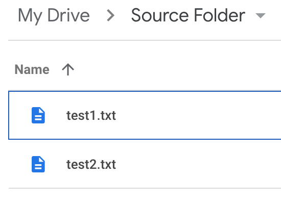
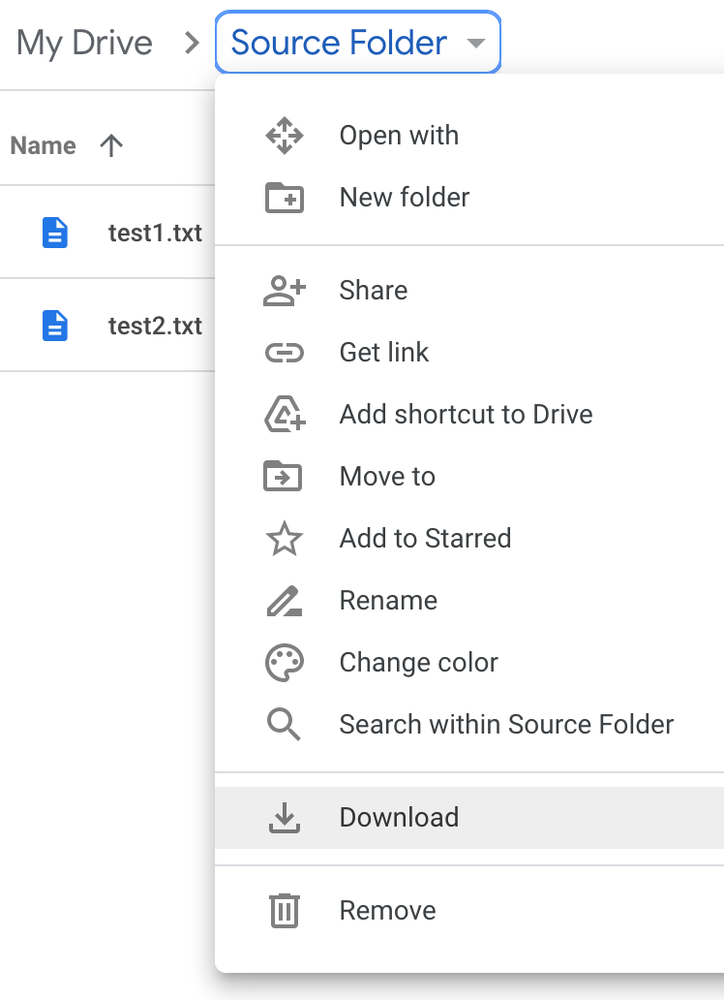
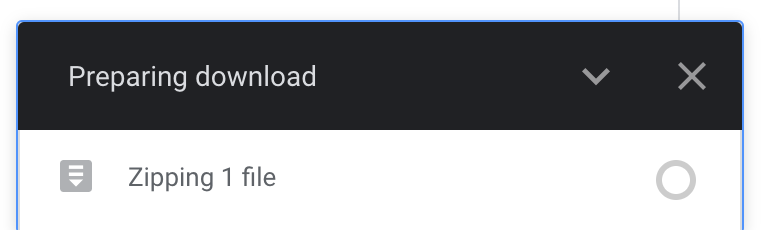
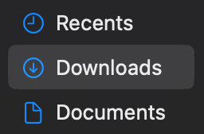
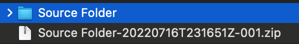
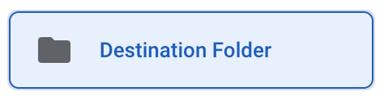
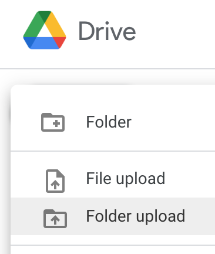
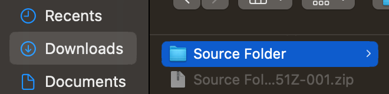
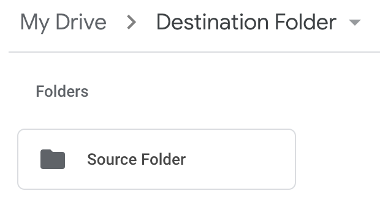

# Copy a file or folder from one Drive to another.

## Overview

This document describes how to copy a folder from one Google Drive into
another. The folder to be copied is downloaded from the original Google Drive
onto your local computer, where it is then uploaded into the new Google
Drive. This process is what's known as a "hard copy", meaning the two copies are
completely independent of one another; modifying one will not affect the other.

## Instructions

|Steps|Instructions|Screenshots|
|-----|------------|-----------|
|1|Navigate to the Google Drive folder to be copied.||
|2|Select the name of the folder to be copied, then select "Download".||
|3|The contents of the folder will be compressed into a zip file and downloaded to your computer.||
|4|Navigate to the folder to which your browser is configured to download files. By default, this is your "Downloads" folder.||
|5|Find and select the downloaded zip file. Its name will be of the form `<source folder name>-<date and time of download>-<numeric identifier>.zip` and will be one of the most recently added files to the Downloads folder.||
|6|Double-click the zip file to unzip it. Depending on your computer, you may be asked to click through a couple windows or specify an unzip location. This document assumes the file was unzipped to its own, new folder within the Downloads folder.||
|7|Navigate to the Google Drive folder into which the source folder will be placed, also known as the destination folder.||
|8|In the top-left corner, select the "New" button, followed by "Folder upload".||
|9|Navigate to and select the source folder.||
|10|Select "Upload".||
|11|The source folder has now been uploaded into the destination folder! Feel free to organize the folder contents as you see fit.||
